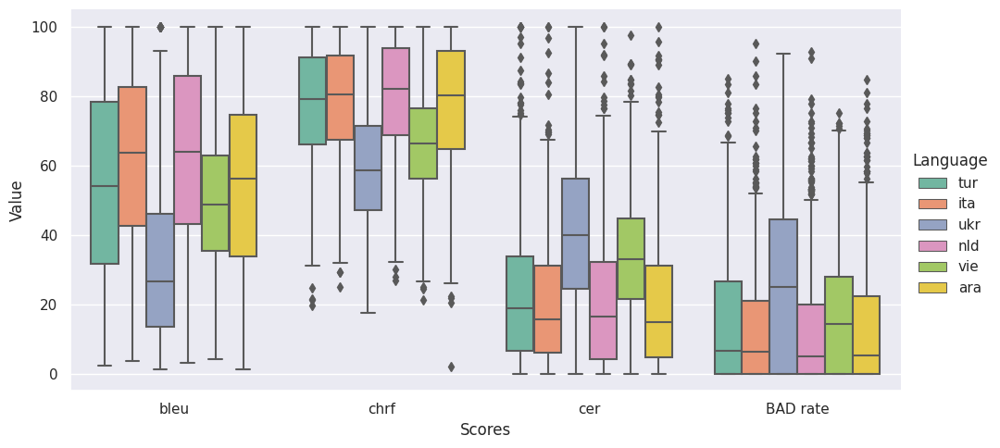

# A Study on Errors in Multilingual Machine Translation

## Authors: Stefania Radu, Lisa Koopmans, Alina Dima

This repository contains 2 python notebooks, one for the [multilingual error analysis](Error_analysis.ipynb), and one for the [editing effort prediction](Editing_effort_prediction.ipynb). It also contains the DivEMT dataset, annotated with new features for prediction.

These notebooks can be run in Google Collaboratory. You can also install all the requiremenets by running: `pip install -r requirements.txt`.

## [Multilingual error analysis](Error_analysis.ipynb)

This notebook generates the plots for the following tasks:

- high level analysis of the errors distribution across all the languages with respect to the BLEU, CHRF, CER and BAD rate. See the plot below as an example.

- in depth analysis of the errors distribution across all languages and across different linguistic features:

    - part-of-speech (POS)
    - named-entity recognition (NER)
    - dependency relations (deprel)

## [Editing effort prediction](Editing_effort_prediction.ipynb)

In this notebook, we train 3 linear regression models to predict the HTER score and post-editing time (PET). The models have different configurations of features. See the paper for an explanation. You can also find the [annotated dataset](dataset_with_features.csv), including the features. We do not provide a pre-trained model, since the linear regression can be easily trained in Google Collaboratory.
